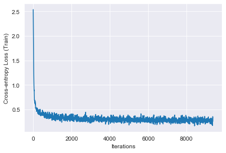
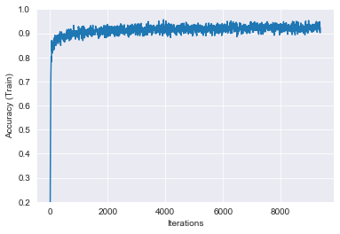
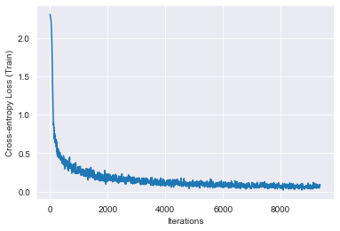
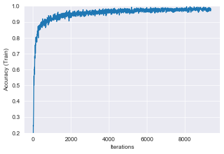
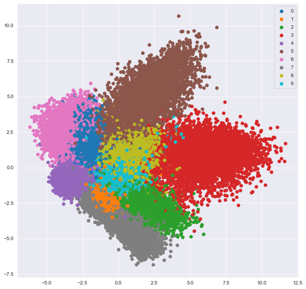

# COMP90051 Workshop 7
## Multiclass Logistic Regression / Model Design in PyTorch / Multilayer Perceptron
Last week we worked through the fundamentals of [PyTorch](https://pytorch.org/) and saw the utility of Automatic on-the-fly differentiation ([Autograd](https://pytorch.org/tutorials/beginner/blitz/autograd_tutorial.html)) for gradient-based optimization. In this workshop we will look at methods developed to handle simple computer vision tasks in Pytorch.

Let's begin by importing the required packages.


```python
import torch
from torch.utils import data
import matplotlib.pyplot as plt
import seaborn as sns
sns.set_style('darkgrid')
%matplotlib inline
import time, os
import numpy as np
from sklearn import decomposition
from sklearn.datasets import make_classification
```

## 1. MNIST dataset

We'll start by using some convenience functions provided by Torch to download the canonical `MNIST` dataset, transform and load it into Tensor format. MNIST is a multi-class classification data set where the instances $\mathbf{x}$ are images of handwritten digits (28×28 pixels with a single 8-bit channel). Here the target $y_k \in \{0, 1, \ldots, 9\}$. We'll train in batches of multiple elements to exploit vectorization of matrix operations. 

The data is already split into training and test sets. The training set contains 60,000 instances and the test set contains 10,000 instances.


```python
import torchvision
import torchvision.transforms as transforms

batch_size = 64

trainset = torchvision.datasets.MNIST('./data', train=True, download=True, transform=transforms.ToTensor())
testset = torchvision.datasets.MNIST('./data', train=False, download=True, transform=transforms.ToTensor())

train_loader = torch.utils.data.DataLoader(trainset, batch_size=batch_size, shuffle=True, drop_last=True)
test_loader = torch.utils.data.DataLoader(testset, batch_size=batch_size, shuffle=False, drop_last=True)
```

We can visualize 8 randomly sampled digits below. 


```python
def imshow(img):
    npimg = img.numpy()
    plt.imshow(np.transpose(npimg, (1, 2, 0)))
    plt.show()

dataiter = iter(train_loader)
images, labels = dataiter.next()

images = images[:8]
labels = labels[:8]

imshow(torchvision.utils.make_grid(images))
```


    

    


```python
dataiter_test = iter(test_loader)
my_matrix = dataiter_test.next()
```


```python
for i, j in enumerate(test_loader):
    n = j
    break
```


```python
len(n[0])
```


    64


We also want to visualize the whole dataset. Since the dimension of the feature is 786, we should use the dimensionality reduction technique to help us to map this into a two-dimensional feature space. Here we'll use (PCA) principal component analysis. We will define a function for plotting in order to reuse it in a later section.


```python
def visualization(x,y):
    
    # decompose x into 2 dimentionality
    pca = decomposition.PCA(n_components = 2)
    x = pca.fit_transform(x)
    
    # plot the dataset
    fig = plt.figure(figsize=(10, 10))
    ax = fig.add_subplot(111)
    scatter = ax.scatter(x[:, 0], x[:, 1], c=y, cmap='tab10')
    handles, labels = scatter.legend_elements()
    ax.legend(handles=handles, labels=labels)
    
instances = trainset.data.view(60000,-1) # flatten image into vector
labels = trainset.targets    
visualization(instances, labels)
```


    

    


## 2. Multiclass Logistic Regression

The handwritten digit recognition task is an example of a _multi-class_ classification problem. 
There are 10 classes—one for each digit $0, 1,\ldots, 9$.
We'll first tackle the problem by generalising binary logistic regression (from workshop 4), to handle _multiple classes_.

We would like to output an $m$-dimensional vector of conditional class probabilities $(p_1, p_2, \ldots, p_m)$. We require $p_k \in [0,1]$ and $\sum_k p_k=1$ by the law of total probability. Taking inspiration from the logistic regression case, we can achieve this by exponentiating the output of our classifier $f(\mathbf{x}) = W^T \mathbf{\Phi}(\mathbf{x}) = \left[\mathbf{w}_0^T\mathbf{\Phi} \vert \ldots \vert \mathbf{w}_m^T\mathbf{\Phi}\right]$, where $\mathbf{\Phi}: \mathbb{R}^d \rightarrow \mathbb{R}^D$ is some possibly nonlinear transformation typically mapping the instance $\mathbf{x} \in \mathbb{R}^d$ to some higher-dimensional space, and $\mathbf{w} \in \mathbb{R}^D$, $W \in \mathbb{R}^{D \times m}$. In essence we have multiple weight vectors $(\mathbf{w}_1, \ldots \mathbf{w}_m)$, one corresponding to each class, and the output $\mathbf{w}_k \cdot \mathbf{\Phi}(\mathbf{x})$ 'scores' how much the classifier thinks the instance $\mathbf{x}$ belongs to class $k$. More concretely, the matrix operation looks like:

\begin{equation}
    W^T \mathbf{\Phi} = \begin{bmatrix}
      \leftarrow \mathbf{w}^{T}_{0} \rightarrow \\
      \leftarrow \mathbf{w}^{T}_{1} \rightarrow \\
      \vdots \\
      \leftarrow \mathbf{w}^{T}_{m} \rightarrow \\ \end{bmatrix}
    \begin{bmatrix}
      \mathbf{\Phi}^{(1)}  \\
      \mathbf{\Phi}^{(2)}  \\
      \vdots \\
      \mathbf{\Phi}^{(D)}
    \end{bmatrix}
    = \begin{bmatrix}
      \mathbf{w}_0 \cdot \mathbf{\Phi}  \\
      \mathbf{w}_1 \cdot \mathbf{\Phi}  \\
      \vdots \\
      \mathbf{w}_m \cdot \mathbf{\Phi}
    \end{bmatrix} \in \mathbb{R}^m \end{equation}

This will return a vector of length $m$. Each dimension of this vector should correspond to the unnormalized probability $\tilde{p}_k$, commonly referred to as the _logits_. We then require normalization of the probability output, which can be achieved by dividing by $\sum_k \tilde{p}_k$. Hence we have:
\begin{align}
    p(y=k \vert \mathbf{x}) = \frac{\exp\left[\left(\mathbf{w}_k^T \Phi(\mathbf{x})\right)\right]}{\sum_n \exp\left[\left(\mathbf{w}_n^T \Phi(\mathbf{x})\right)\right]}
\end{align}
The process of converting the unnormalized weight-feature dot product(s) to a normalized distribution is called a softmax operation. Since the exponential is monotonic, the class prediction is given by taking the index with the highest conditional probability - i.e. the highest score $\mathbf{w}_k^T \mathbf{\Phi}(\mathbf{x})$. The classifier is trained by minimizing the negative log likelihood, which corresponds to the negative cross entropy loss.

\begin{equation}
    \mathcal{L}(\mathbf{w}) = -\log \prod_k p(y=k \vert \mathbf{x}; \mathbf{w}) = -\sum_k y_k \log p\left(y=k \vert \mathbf{x}; \mathbf{w}\right)
\end{equation}

## 3. Model design with `torch.nn.Module`

We'll want to compare a couple of different architectures when attacking this problem. Iterating over different models in the ad-hoc manner we saw last week can quickly get messy. Model design typically (but not always!) decomposes into an _initialization phase_, where the model parameters are defined, and the _forward phase_, where the input tensors $\mathbf{x}$ pass through the Directed Acyclic Graph of operations to produce the model output, the logits $\Phi(\mathbf{x})$. The canonical method of model design in PyTorch reflects this decomposition. We start with inheriting from `torch.nn.Module`, which allows us to access common NN-specific functionality, then:

* Implement the constructor `__init__(self, ...)`. Here we define all network parameters.
* Override the forward method `forward(self, x)`. This accepts the input tensor `x` and returns our desired model output.

Provided your operations are autograd-compliant, the backward pass is implemented automatically as PyTorch walks the computational graph backward. Imagine if you had to manually compute your own parameter gradients - what a time-saver! We'll look at multiple examples of this today, starting with the logistic regression model we investigated last week.


```python
import torch.nn as nn
import torch.nn.functional as F

class LogisticRegressionModel(nn.Module):
    
    def __init__(self, n_features, n_classes):
        super(LogisticRegressionModel, self).__init__()
        
        # Register weight matrix and bias term as model parameters - automatically tracks operations for gradient computation.
        self.W = torch.nn.Parameter(torch.nn.init.xavier_uniform_(torch.empty([n_features, n_classes])))  # Weights
        self.b = torch.nn.Parameter(torch.zeros([n_classes]))  # Biases
        
    def forward(self, x):
        """
        Forward pass for logistic regression.
        Input: Tensor x of shape [N,C,H,W] ([batch size, channels, height, width])
        Output: Logits W @ x + b
        """
        batch_size = x.shape[0]
        
        x = x.view(batch_size, -1)  # Flatten image into vector, retaining batch dimension
        print("=" * 25)
        print("-----yhat-----")
        print(torch.matmul(x,self.W).shape)
        print("----b----")
        print(self.b.shape)
        print("=" * 25)

        out = torch.matmul(x,self.W) + self.b  # Compute scores
        return out
```

The parameters added as class attributes are now associated with your module, access them using `Module.parameters()`. Also note the `(...)` operator is redefined to call the `forward` method. You may want to check out the documentation below.


```python
torch.nn.Module?
```

    Init signature: torch.nn.Module() -> None
    Docstring:     
    Base class for all neural network modules.
    
    Your models should also subclass this class.
    
    Modules can also contain other Modules, allowing to nest them in
    a tree structure. You can assign the submodules as regular attributes::
    
        import torch.nn as nn
        import torch.nn.functional as F
    
        class Model(nn.Module):
            def __init__(self):
                super().__init__()
                self.conv1 = nn.Conv2d(1, 20, 5)
                self.conv2 = nn.Conv2d(20, 20, 5)
    
            def forward(self, x):
                x = F.relu(self.conv1(x))
                return F.relu(self.conv2(x))
    
    Submodules assigned in this way will be registered, and will have their
    parameters converted too when you call :meth:`to`, etc.
    
    .. note::
        As per the example above, an ``__init__()`` call to the parent class
        must be made before assignment on the child.
    
    :ivar training: Boolean represents whether this module is in training or
                    evaluation mode.
    :vartype training: bool
    Init docstring: Initializes internal Module state, shared by both nn.Module and ScriptModule.
    File:           /Library/Frameworks/Python.framework/Versions/3.10/lib/python3.10/site-packages/torch/nn/modules/module.py
    Type:           type
    Subclasses:     Identity, Linear, Bilinear, _ConvNd, Threshold, ReLU, RReLU, Hardtanh, Sigmoid, Hardsigmoid, ...


```python
n_features, n_classes = 28*28*1, 10  # Here we flatten the 3D image into a 1D vector
logistic_regression_model = LogisticRegressionModel(n_features, n_classes)

for p in logistic_regression_model.parameters():
    print(p.shape)
```

    torch.Size([784, 10])
    torch.Size([10])


We'll write a convenient `train` and `test` function that allows us to seamlessly substitute different models - this is essential for fast iteration during development in The Real World. The basic structure is identical to what you encountered last week.


```python
def test(model, criterion, test_loader):
    test_loss = 0.
    test_preds, test_labels = list(), list()
    for i, data in enumerate(test_loader):
        x, labels = data

        with torch.no_grad():
            logits = model(x)  # Compute scores
            predictions = torch.argmax(logits, dim=1)
            test_loss += criterion(input=logits, target=labels).item()
            test_preds.append(predictions)
            test_labels.append(labels)

    test_preds = torch.cat(test_preds)
    test_labels = torch.cat(test_labels)

    test_accuracy = torch.eq(test_preds, test_labels).float().mean().item()

    print('[TEST] Mean loss {:.4f} | Accuracy {:.4f}'.format(test_loss/len(test_loader), test_accuracy))

def train(model, train_loader, test_loader, optimizer, n_epochs=10):
    """
    Generic training loop for supervised multiclass learning
    """
    LOG_INTERVAL = 250
    running_loss, running_accuracy = list(), list()
    start_time = time.time()
    criterion = torch.nn.CrossEntropyLoss()

    # for epoch in range(n_epochs):  # Loop over training dataset `n_epochs` times
    for epoch in range(1):

        epoch_loss = 0.

        for i, data in enumerate(train_loader):  # Loop over elements in training set

            x, labels = data

            logits = model(x)

            predictions = torch.argmax(logits, dim=1)
            train_acc = torch.mean(torch.eq(predictions, labels).float()).item()

            loss = criterion(input=logits, target=labels)

            loss.backward()               # Backward pass (compute parameter gradients)
            optimizer.step()              # Update weight parameter using SGD
            optimizer.zero_grad()         # Reset gradients to zero for next iteration


            # ============================================================================
            # You can safely ignore the boilerplate code below - just reports metrics over
            # training and test sets

            running_loss.append(loss.item())
            running_accuracy.append(train_acc)

            epoch_loss += loss.item()

            if i % LOG_INTERVAL == 0:  # Log training stats
                deltaT = time.time() - start_time
                mean_loss = epoch_loss / (i+1)
                print('[TRAIN] Epoch {} [{}/{}]| Mean loss {:.4f} | Train accuracy {:.5f} | Time {:.2f} s'.format(epoch, 
                    i, len(train_loader), mean_loss, train_acc, deltaT))

        print('Epoch complete! Mean loss: {:.4f}'.format(epoch_loss/len(train_loader)))

        test(model, criterion, test_loader)
        # break
        
    return running_loss, running_accuracy
```

Load the model parameters into our selected optimizer and we're good to go. We'll include a `momentum` term in the standard SGD update rule to accelerate convergence. Intiutively, this helps the optimizer ignore parameter updates in suboptimal directions, possibly due to noise in the model. 


```python
optimizer = torch.optim.SGD(logistic_regression_model.parameters(), lr=1e-2, momentum=0.9)
lr_loss, lr_acc = train(logistic_regression_model, train_loader, test_loader, optimizer)
```

    =========================
    -----yhat-----
    torch.Size([64, 10])
    ----b----
    torch.Size([10])
    =========================
    [TRAIN] Epoch 0 [0/937]| Mean loss 2.3751 | Train accuracy 0.14062 | Time 0.02 s
    =========================
    -----yhat-----
    torch.Size([64, 10])
    ----b----
    torch.Size([10])
    =========================
    [TEST] Mean loss 0.3361 | Accuracy 0.9104


You should be getting $>90/\%$ train accuracy with similar test accuracy within a minute on CPU _(note to tutors - check on your machine?)_, not bad for a _linear method_! 😎 Finally, let's plot the loss and accuracy curves. You may want to fiddle with the learning rate when your loss starts to plateau.


```python
from scipy.signal import savgol_filter  # Smooth spiky curves
running_loss_smoothed = savgol_filter(lr_loss, 21, 3)
running_acc_smoothed = savgol_filter(lr_acc, 21, 3)
```


```python
plt.plot(running_loss_smoothed)
plt.xlabel('Iterations')
plt.ylabel('Cross-entropy Loss (Train)')
```


    Text(0, 0.5, 'Cross-entropy Loss (Train)')


    

    


```python
plt.plot(running_acc_smoothed)
plt.xlabel('Iterations')
plt.ylabel('Accuracy (Train)')
plt.ylim(0.2,1.)
```


    (0.2, 1.0)


    

    


## 4. Multilayer Perceptron

Let's see if we can improve on logistic regression using a neural network.

We'll construct a multilayer perceptron (MLP), one of the most fundamental neural network architectures. It's a feed-forward and fully connected network, also known as a feed-forward neural network.

There are three types of fully connected (dense) layers of MLP:

* **Input layer** with input nodes $\mathbf{x}$: the first layer, takes features as inputs
* **Output layer** with output nodes $\mathbf{y}$: the last layer, has one node per possible output
* **Hidden layers** with hidden nodes $\mathbf{h}$: all layers in between.

Each node is a neuron that uses a nonlinear activation function, expect for the input nodes.

We also make use of [dropout](http://www.cs.toronto.edu/~rsalakhu/papers/srivastava14a.pdf) (a regularization method whereby random units are removed from the network) to prevent overfitting.

We describe the architecture in further detail below:

1. *Fully Connected Layer #1* | 786 input units (flattened image), 256 output units. ReLU activation function.
2. *Dropout #1*         | Randomly drops a fraction 0.25 of the input units.	
3. *Fully Connected Layer #2* | 256 input units (flattened image), 100 output units. ReLU activation function.
4. *Dropout #2*         | Randomly drops a fraction 0.25 of the input units.
5. *Fully Connected Layer #1* | 100 input units, 10 output units - yields logits for classification.

***


```python
import torch.nn.functional as F

HIDDEN_DIM1 = 256
HIDDEN_DIM2 = 100

class MultilayerPerceptronModel(nn.Module):
    
    def __init__(self, n_features, n_classes, hidden_dim1 = HIDDEN_DIM1, hidden_dim2 = HIDDEN_DIM2):
        super().__init__()
        
        self.input_layer = nn.Linear(n_features, hidden_dim1)
        self.hidden_layer = nn.Linear(hidden_dim1, hidden_dim2)
        self.output_layer = nn.Linear(hidden_dim2, n_classes)
        self.dropout = nn.Dropout(0.25)

    def forward(self, x):

        batch_size = x.shape[0]
        
        x = x.view(batch_size, -1)  # Flatten image into vector, retaining batch dimension
        
        x = F.relu(self.input_layer(x))
        x = self.dropout(x)
        
        
        self.rep1 = x #for plotting purpose
        
        x = F.relu(self.hidden_layer(x))
        x = self.dropout(x)
        
        self.rep2 = x #for plotting purpose
        
        out = self.output_layer(x)
        
        return out
        
```


```python
mlp_model = MultilayerPerceptronModel(n_features, n_classes)
optimizer = torch.optim.SGD(mlp_model.parameters(), lr=1e-2, momentum=0.9)
mlp_loss, mlp_acc = train(mlp_model, train_loader, test_loader, optimizer)
```

    [TRAIN] Epoch 0 [0/937]| Mean loss 2.3028 | Train accuracy 0.07812 | Time 0.02 s
    [TRAIN] Epoch 0 [250/937]| Mean loss 1.2335 | Train accuracy 0.82812 | Time 2.47 s
    [TRAIN] Epoch 0 [500/937]| Mean loss 0.8401 | Train accuracy 0.93750 | Time 4.81 s
    [TRAIN] Epoch 0 [750/937]| Mean loss 0.6778 | Train accuracy 0.92188 | Time 7.00 s
    Epoch complete! Mean loss: 0.6025
    [TEST] Mean loss 0.2605 | Accuracy 0.9233
    [TRAIN] Epoch 1 [0/937]| Mean loss 0.3058 | Train accuracy 0.90625 | Time 10.08 s
    [TRAIN] Epoch 1 [250/937]| Mean loss 0.2648 | Train accuracy 0.92188 | Time 12.48 s
    [TRAIN] Epoch 1 [500/937]| Mean loss 0.2513 | Train accuracy 0.92188 | Time 14.98 s
    [TRAIN] Epoch 1 [750/937]| Mean loss 0.2375 | Train accuracy 0.90625 | Time 17.31 s
    Epoch complete! Mean loss: 0.2280
    [TEST] Mean loss 0.1807 | Accuracy 0.9454
    [TRAIN] Epoch 2 [0/937]| Mean loss 0.1920 | Train accuracy 0.93750 | Time 20.25 s
    [TRAIN] Epoch 2 [250/937]| Mean loss 0.1823 | Train accuracy 0.98438 | Time 22.64 s
    [TRAIN] Epoch 2 [500/937]| Mean loss 0.1752 | Train accuracy 0.96875 | Time 25.29 s
    [TRAIN] Epoch 2 [750/937]| Mean loss 0.1704 | Train accuracy 0.93750 | Time 27.60 s
    Epoch complete! Mean loss: 0.1689
    [TEST] Mean loss 0.1496 | Accuracy 0.9550
    [TRAIN] Epoch 3 [0/937]| Mean loss 0.2109 | Train accuracy 0.92188 | Time 30.30 s
    [TRAIN] Epoch 3 [250/937]| Mean loss 0.1401 | Train accuracy 0.93750 | Time 32.53 s
    [TRAIN] Epoch 3 [500/937]| Mean loss 0.1375 | Train accuracy 0.93750 | Time 34.80 s
    [TRAIN] Epoch 3 [750/937]| Mean loss 0.1352 | Train accuracy 0.98438 | Time 36.97 s
    Epoch complete! Mean loss: 0.1335
    [TEST] Mean loss 0.1321 | Accuracy 0.9600
    [TRAIN] Epoch 4 [0/937]| Mean loss 0.0847 | Train accuracy 0.96875 | Time 39.68 s
    [TRAIN] Epoch 4 [250/937]| Mean loss 0.1134 | Train accuracy 0.93750 | Time 41.85 s
    [TRAIN] Epoch 4 [500/937]| Mean loss 0.1128 | Train accuracy 0.95312 | Time 44.03 s
    [TRAIN] Epoch 4 [750/937]| Mean loss 0.1149 | Train accuracy 0.96875 | Time 46.20 s
    Epoch complete! Mean loss: 0.1138
    [TEST] Mean loss 0.1188 | Accuracy 0.9635
    [TRAIN] Epoch 5 [0/937]| Mean loss 0.1743 | Train accuracy 0.92188 | Time 48.90 s
    [TRAIN] Epoch 5 [250/937]| Mean loss 0.0977 | Train accuracy 0.95312 | Time 51.07 s
    [TRAIN] Epoch 5 [500/937]| Mean loss 0.0992 | Train accuracy 0.95312 | Time 53.24 s
    [TRAIN] Epoch 5 [750/937]| Mean loss 0.0984 | Train accuracy 0.98438 | Time 55.41 s
    Epoch complete! Mean loss: 0.0981
    [TEST] Mean loss 0.1121 | Accuracy 0.9655
    [TRAIN] Epoch 6 [0/937]| Mean loss 0.1300 | Train accuracy 0.95312 | Time 58.14 s
    [TRAIN] Epoch 6 [250/937]| Mean loss 0.0896 | Train accuracy 0.98438 | Time 60.31 s
    [TRAIN] Epoch 6 [500/937]| Mean loss 0.0911 | Train accuracy 0.93750 | Time 62.48 s
    [TRAIN] Epoch 6 [750/937]| Mean loss 0.0901 | Train accuracy 1.00000 | Time 64.66 s
    Epoch complete! Mean loss: 0.0889
    [TEST] Mean loss 0.1076 | Accuracy 0.9679
    [TRAIN] Epoch 7 [0/937]| Mean loss 0.1479 | Train accuracy 0.93750 | Time 67.37 s
    [TRAIN] Epoch 7 [250/937]| Mean loss 0.0815 | Train accuracy 0.95312 | Time 69.55 s
    [TRAIN] Epoch 7 [500/937]| Mean loss 0.0801 | Train accuracy 0.98438 | Time 71.72 s
    [TRAIN] Epoch 7 [750/937]| Mean loss 0.0784 | Train accuracy 0.96875 | Time 73.89 s
    Epoch complete! Mean loss: 0.0796
    [TEST] Mean loss 0.0996 | Accuracy 0.9714
    [TRAIN] Epoch 8 [0/937]| Mean loss 0.0836 | Train accuracy 0.95312 | Time 76.60 s
    [TRAIN] Epoch 8 [250/937]| Mean loss 0.0745 | Train accuracy 0.95312 | Time 78.77 s
    [TRAIN] Epoch 8 [500/937]| Mean loss 0.0741 | Train accuracy 0.98438 | Time 80.99 s
    [TRAIN] Epoch 8 [750/937]| Mean loss 0.0730 | Train accuracy 0.95312 | Time 83.18 s
    Epoch complete! Mean loss: 0.0722
    [TEST] Mean loss 0.0972 | Accuracy 0.9710
    [TRAIN] Epoch 9 [0/937]| Mean loss 0.0415 | Train accuracy 1.00000 | Time 85.94 s
    [TRAIN] Epoch 9 [250/937]| Mean loss 0.0660 | Train accuracy 1.00000 | Time 88.14 s
    [TRAIN] Epoch 9 [500/937]| Mean loss 0.0642 | Train accuracy 0.96875 | Time 90.32 s
    [TRAIN] Epoch 9 [750/937]| Mean loss 0.0652 | Train accuracy 0.98438 | Time 92.50 s
    Epoch complete! Mean loss: 0.0661
    [TEST] Mean loss 0.0881 | Accuracy 0.9728


You should get about 97% accuracy in test performance. Like logistic regression, we'll plot the loss and accuracy curves below.


```python
mlp_loss_smoothed = savgol_filter(mlp_loss, 21, 3)
mlp_acc_smoothed = savgol_filter(mlp_acc, 21, 3)
```


```python
plt.plot(mlp_loss_smoothed)
plt.xlabel('Iterations')
plt.ylabel('Cross-entropy Loss (Train)')
```


    Text(0, 0.5, 'Cross-entropy Loss (Train)')


    

    


```python
plt.plot(mlp_acc_smoothed)
plt.xlabel('Iterations')
plt.ylabel('Accuracy (Train)')
plt.ylim(0.2,1.)
```


    (0.2, 1.0)


    

    


## 5. Visualize representations
As we covered in Lecture 11, deep ANNs can be treated as representation learning, hidden layers can be thought of as the transformed feature spaces. Now, let's extract the tranformed feature spaces after different hidden layers to see how our model learn the transformation and representations of data.

First, we need to extract the representation for each instance.


```python
reps1 = [] # representations after first hidden layer
reps2 = [] # representations after secton hidden layer
mlp_model.eval()
with torch.no_grad():
    for (x,y) in trainset:
        y_hat = mlp_model(x)
        reps1.append(mlp_model.rep1)
        reps2.append(mlp_model.rep2)
reps1 = torch.cat(reps1, dim=0)
reps2 = torch.cat(reps2, dim=0)
print(reps1.shape)
print(reps2.shape)
```

    torch.Size([60000, 256])
    torch.Size([60000, 100])


```python
visualization(reps1, labels) # plotting for the first representations
```


    

    


```python
visualization(reps2, labels) # plotting for the second representations
```


    

    


***
**Question:** Comparing three feature spaces we plotted, what do you find?

_Answer: Compared with the original input space, we can more easily distinguish the difference between different label data in the representation feature spaces. Especially after the last hidden layer, it can be seen that the clustering of each label is much less overlapping. This demonstrates how effectively our model has learned the feature transformations._
***

## **Bonus:** 
Can you improve on this? You may want to try training with more epoches, adding more layers, using different number of hidden_dim, or changing the optimizer, experimenting with learning rates or momentum. Some quick modifications should allow you to surpass 98% accuracy pretty easily.

That's all for this week. Next week we'll building a convolutional NN architecture on more challenging image classification task.
